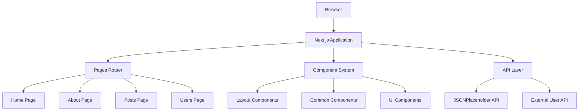

# Design Document

## Overview

The ALX Next.js Project is a comprehensive learning application that demonstrates modern React development patterns using Next.js 15, TypeScript, and Tailwind CSS. The application follows a component-based architecture with clear separation of concerns, utilizing the Pages Router for navigation and external APIs for dynamic content.

The project is structured as a multi-page application with reusable components, proper TypeScript interfaces, and responsive design principles. It serves as both a learning tool and a reference implementation for Next.js best practices.

## Architecture

### High-Level Architecture



### Technology Stack

- **Framework**: Next.js 15 with Pages Router
- **Language**: TypeScript for type safety
- **Styling**: Tailwind CSS 4 for utility-first styling
- **State Management**: React hooks (useState, useEffect)
- **API Integration**: Native fetch API
- **Development Tools**: ESLint for code quality

### Project Structure

```
alx-project-2/
├── components/
│   ├── layout/
│   │   └── Header.tsx
│   └── common/
│       ├── Card.tsx
│       ├── Button.tsx
│       ├── PostCard.tsx
│       ├── UserCard.tsx
│       └── PostModal.tsx
├── interfaces/
│   └── index.ts
├── pages/
│   ├── index.tsx
│   ├── home.tsx
│   ├── about.tsx
│   ├── posts.tsx
│   └── users.tsx
├── public/
│   └── assets/
│       └── images/
└── styles/
    └── globals.css
```

## Components and Interfaces

### Core Interfaces

The application uses TypeScript interfaces to ensure type safety across all components:

```typescript
// interfaces/index.ts
export interface CardProps {
  title: string;
  content: string;
}

export interface ButtonProps {
  children: React.ReactNode;
  size: 'small' | 'medium' | 'large';
  shape: 'rounded-sm' | 'rounded-md' | 'rounded-full';
  onClick?: () => void;
}

export interface PostProps {
  id: number;
  title: string;
  body: string;
  userId: number;
}

export interface UserProps {
  id: number;
  name: string;
  email: string;
  address: {
    street: string;
    city: string;
    zipcode: string;
  };
}
```

### Layout Components

#### Header Component
- **Purpose**: Provides consistent navigation across all pages
- **Features**: Responsive navigation menu with active state indicators
- **Implementation**: Uses Next.js Link component for client-side routing
- **Styling**: Tailwind CSS with mobile-first responsive design

### Common Components

#### Card Component
- **Purpose**: Reusable content container for displaying title and content
- **Props**: Accepts title and content as required props
- **Styling**: Consistent card design with shadow and padding
- **Usage**: Used throughout the application for content display

#### Button Component
- **Purpose**: Standardized button with size and shape variations
- **Props**: Size (small/medium/large) and shape (rounded variants)
- **Features**: Hover states and consistent styling
- **Accessibility**: Proper ARIA attributes and keyboard navigation

#### PostCard Component
- **Purpose**: Specialized card for displaying post data from API
- **Props**: Post object with id, title, body, and userId
- **Features**: Truncated content with read more functionality
- **Integration**: Connects with JSONPlaceholder API data

#### UserCard Component
- **Purpose**: Displays user profile information in card format
- **Props**: User object with personal and address information
- **Features**: Structured layout for user details
- **Integration**: Connects with external user API

#### PostModal Component
- **Purpose**: Modal dialog for creating new posts
- **Features**: Form validation, state management, and parent communication
- **Implementation**: Portal-based modal with backdrop click handling
- **State**: Manages form data and modal visibility

### Page Components

#### Home Page (`/home`)
- **Purpose**: Main landing page with dynamic content
- **Features**: Card components display, modal integration
- **State**: Manages list of user-created posts
- **Interactions**: Add new posts via modal, display existing content

#### About Page (`/about`)
- **Purpose**: Information page demonstrating button variations
- **Features**: Multiple button components with different props
- **Content**: Static content about the project

#### Posts Page (`/posts`)
- **Purpose**: Displays posts fetched from JSONPlaceholder API
- **Features**: API integration, loading states, error handling
- **Components**: Uses PostCard components for display
- **Data Flow**: Fetch → State → Render pattern

#### Users Page (`/users`)
- **Purpose**: Displays user profiles from external API
- **Features**: User data fetching, responsive grid layout
- **Components**: Uses UserCard components for display
- **Error Handling**: Graceful degradation for API failures

## Data Models

### Post Data Model
```typescript
interface Post {
  id: number;
  title: string;
  body: string;
  userId: number;
}
```

### User Data Model
```typescript
interface User {
  id: number;
  name: string;
  email: string;
  address: {
    street: string;
    city: string;
    zipcode: string;
  };
  phone?: string;
  website?: string;
}
```

### Form Data Model
```typescript
interface PostFormData {
  title: string;
  content: string;
}
```

## Error Handling

### API Error Handling
- **Network Errors**: Display user-friendly error messages
- **Loading States**: Show loading indicators during API calls
- **Fallback Content**: Provide default content when APIs fail
- **Retry Mechanisms**: Allow users to retry failed requests

### Form Validation
- **Client-side Validation**: Real-time validation for form inputs
- **Required Fields**: Ensure all required fields are completed
- **Error Messages**: Clear, actionable error messages
- **Success Feedback**: Confirmation when actions complete successfully

### Component Error Boundaries
- **Graceful Degradation**: Components fail gracefully without breaking the app
- **Error Logging**: Log errors for debugging purposes
- **User Experience**: Maintain usable interface even with component failures

## Testing Strategy

### Component Testing
- **Unit Tests**: Test individual components in isolation
- **Props Testing**: Verify components render correctly with different props
- **Event Handling**: Test user interactions and event handlers
- **Accessibility**: Ensure components meet accessibility standards

### Integration Testing
- **API Integration**: Test API calls and data handling
- **Navigation**: Verify routing works correctly between pages
- **State Management**: Test state updates and data flow
- **Modal Interactions**: Test modal opening, closing, and form submission

### End-to-End Testing
- **User Workflows**: Test complete user journeys
- **Cross-browser**: Ensure compatibility across different browsers
- **Responsive Design**: Test on various screen sizes
- **Performance**: Monitor loading times and user experience

## Performance Considerations

### Code Splitting
- **Page-level Splitting**: Automatic code splitting by Next.js
- **Component Lazy Loading**: Load components only when needed
- **Bundle Optimization**: Minimize JavaScript bundle sizes

### API Optimization
- **Caching**: Implement appropriate caching strategies
- **Loading States**: Provide immediate feedback during API calls
- **Error Recovery**: Handle network failures gracefully

### Image Optimization
- **Next.js Image**: Use Next.js Image component for optimization
- **Asset Management**: Organize and optimize static assets
- **Responsive Images**: Serve appropriate image sizes for different devices

## Security Considerations

### Input Validation
- **Form Sanitization**: Sanitize all user inputs
- **XSS Prevention**: Prevent cross-site scripting attacks
- **Data Validation**: Validate data types and formats

### API Security
- **HTTPS**: Use secure connections for all API calls
- **Error Handling**: Don't expose sensitive information in error messages
- **Rate Limiting**: Implement appropriate rate limiting for API calls